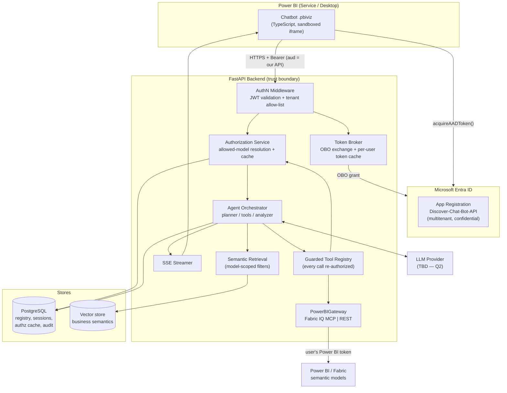
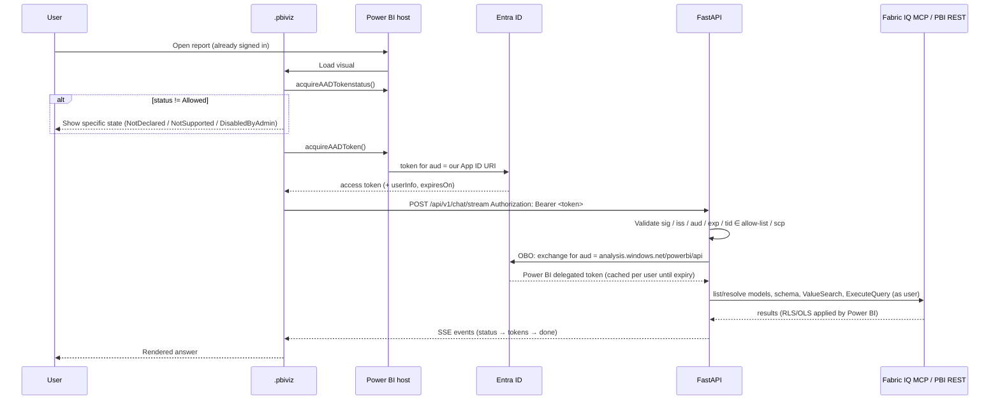

# Discover Chat Bot — Phase-wise Implementation Plan

> Power BI custom visual (`.pbiviz`) chatbot that answers natural-language questions over Power BI semantic models,
> with a FastAPI agent backend, strictly limited to the semantic models the signed-in user is authorized to access.

| Item | Value |
|---|---|
| Status | **Phases 1, 3, 4, 5, 6 and 7 DONE 2026-10-06.** Phase 0 is with IT (docs/entra-setup.md). Phase 2 waits on IT. Next candidate: Phase 8 (needs Q13) |
| Last research pass | 2026-10-06 (Microsoft Learn docs verified, see §13) |
| Approval model | Each phase is implemented only after explicit approval. Nothing beyond the current approved phase is built. |

---

## Table of contents

1. [Core invariant](#1-core-invariant)
2. [Research findings that change the original design](#2-research-findings-that-change-the-original-design)
3. [Target architecture](#3-target-architecture)
4. [Identity & token flow (end-to-end)](#4-identity--token-flow-end-to-end)
5. [Data placement: Power BI vs PostgreSQL vs Vector DB](#5-data-placement-power-bi-vs-postgresql-vs-vector-db)
6. [Authorization model](#6-authorization-model)
7. [Security scenario matrix](#7-security-scenario-matrix)
8. [Proposed repository layout](#8-proposed-repository-layout)
9. [Phase plan (0 → 13)](#9-phase-plan)
10. [API surface](#10-api-surface)
11. [Risks & mitigations](#11-risks--mitigations)
12. [Open questions (to be answered one by one)](#12-open-questions)
13. [Sources](#13-sources)

---

## 1. Core invariant

> **No user request can cause the system to query or reveal any data or metadata of a semantic model unless the
> authenticated user is authorized for that model — and Power BI itself is the final enforcer of that authorization.**

This applies to: direct questions, comparisons, follow-ups, indirect references, vector search, MCP tools, REST tools,
DAX execution, schema/metadata, generated measures, cached results, logs, and error messages.

Three rules derived from it:

1. **Authentication** identifies the user (Entra ID token validated by the backend).
2. **Authorization** decides which semantic models the user may touch (our authz service + Power BI as source of truth).
3. **The LLM is never an authority.** It only ever sees an allow-listed model set, and every tool call is re-checked
   server-side. Every Power BI call is made **with the user's own delegated token**, never a shared service principal.

---

## 2. Research findings that change the original design

The architecture described in the brief is sound. The Microsoft documentation adds the following facts, and several of
them change the design.

### 2.1 The visual's SSO token is NOT a Power BI token → we need On-Behalf-Of (OBO)

`acquireAADToken()` returns a token whose **audience is our backend's Application ID URI**, not Power BI.
To query Power BI *as the user*, the backend must exchange it using the **OAuth 2.0 On-Behalf-Of flow** for a token with
audience `https://analysis.windows.net/powerbi/api`.

Consequences:
- The backend app registration is a **confidential client**: it needs a client secret or (preferred) certificate,
  stored server-side only (Key Vault). The `.pbiviz` never contains secrets.
- The backend app registration needs **delegated** Power BI Service permissions (exact set depends on query path, §2.3).
- Admin consent for those delegated permissions in the consuming tenant.
- This is fully compatible with "don't use a service principal as the user's identity". The OBO token *is* the user.

### 2.2 Authentication API constraints (verified)

| Constraint | Detail |
|---|---|
| Visual type | "applicable only for **AppSource visuals**, and **not for private visuals**". Debug visuals work for development. |
| API version | `apiVersion` ≥ **5.9.1** in `pbiviz.json` |
| Privilege | `"AADAuthentication"` with per-cloud params, e.g. `{"COM": "https://<our-app-id-uri>"}` |
| Tenant switch | Admin portal switch, **disabled by default** |
| Supported hosts | Web, Desktop, RS Desktop, Mobile |
| **Not** supported | RS Service, **Embedded analytics**, **Teams** |
| Desktop | Blocked if user isn't signed in to Desktop |
| Status values | `Allowed`, `NotDeclared`, `NotSupported`, `DisabledByAdmin` → each needs a distinct UI state |

**Entra app registration requirements specific to this API (not in the original brief):**
- App must be **multitenant** ("Any Microsoft Entra ID tenant").
- **Application ID URI must be a verified custom domain**, start with `https://`, and **must not contain `onmicrosoft.com`**.
- A scope named **`<visual_guid>_CV_ForPBI`** (40-char limit; editable in manifest). Our generated GUID
  `discoverChatBot09E811F9CAF94C58AD6EEF5D7849A3F7` makes this 57 chars, so the scope must be set through the
  **app manifest**, not the portal form.
- **Pre-authorize** these Power BI client apps on that scope (COM cloud):
  - Power BI WFE: `871c010f-5e61-4fb1-83ac-98610a7e9110`
  - Power BI Desktop: `7f67af8a-fedc-4b08-8b4e-37c4d127b6cf`
  - Power BI Mobile: `c0d2a505-13b8-4ae0-aa9e-cddd5eab0b12`
- Backend must be consented to **Graph** (typically `User.Read`) in the consuming tenant. The brief said Graph isn't
  needed. That's true for identity data, but Microsoft lists missing Graph consent as a reason token acquisition is blocked.

**Because the app is multitenant, the backend must enforce a tenant allow-list.** Otherwise any Entra tenant that
installs an AppSource visual could obtain a valid token for our audience.

### 2.3 Power BI query paths: there are now three, not two

| | **Fabric IQ MCP** (new, GA) | Power BI Consumption MCP (preview) | Execute Queries REST |
|---|---|---|---|
| Endpoint | `https://fabriciq.svc.cloud.microsoft/v1/mcp/fabriciq` | `https://api.fabric.microsoft.com/v1/mcp/powerbi` | `POST /v1.0/myorg/datasets/{id}/executeQueries` |
| Microsoft guidance | **"Prefer"** for semantic-model consumption | Earlier endpoint, preview | Classic API |
| Auth | Delegated only (SP/app-only **not supported**) | Delegated; SP supported but **no RLS** | Delegated or SP (SP **not** supported on RLS / SSO models) |
| Permission needed | Existing Fabric permissions, **no Build permission required** | **Build** | **Read + Build** + tenant setting "Dataset Execute Queries REST API" |
| Delegated scopes | `Item.Read.All`, `Item.Execute.All`, `Dataset.Read.All` | `Dataset.Read.All`, `Workspace.Read.All`, `MLModel.Execute.All` | `Dataset.Read.All` |
| RLS / OLS | Enforced (RLS + OLS) | RLS enforced for user auth | RLS enforced for user auth |
| Tools | `DiscoverArtifacts`, `ResolveFabricItem`, `GetReportMetadata`, `GetSemanticModelSchema`, `ValueSearch`, `ExecuteQuery` | Execute Query, Get Schema, Get Report Metadata, Generate Query (Copilot licence) | DAX only |
| Limits | 1 model per `ExecuteQuery`; 250 rows default (`maxRows`); throttling | 100k rows | 1 query/1 table per call; 100k rows / 1M values / 15 MB; **120 queries/min/user** |
| Availability caveat | **Not available in Power BI-only regions or sovereign clouds** | Tenant setting (preview) | Tenant setting |
| Versioning | Pin with header `X-Variants: Fabric.Routing.FabricIQ.V1` | — | v1.0 |

**Implications:**
- Brief's *Scenario 3* ("report access but no Build permission") may be **solvable** via Fabric IQ MCP, which doesn't
  require Build. This must be verified in the Phase 2 spike.
- **`ValueSearch`** finds dimension values (e.g. `"GOLD"` in `LOB`) **under the user's identity, with RLS applied**. That
  lets us avoid indexing actual data values in the Vector DB (§5.3).
- Recommendation: **Fabric IQ MCP as primary**, Execute Queries REST as a fallback behind the same `PowerBIGateway`
  interface. Decision pending (Q3).

### 2.4 Custom visual sandbox facts

- Visuals run in a **sandboxed iframe**. Network calls require the **`WebAccess`** privilege listing the backend origin
  (wildcard subdomains allowed). The admin must allow it too.
- New tabs only via `host.launchUrl()` (http/https only). No interactive OAuth popups/redirects inside the visual,
  which is why SSO via the Authentication API matters.
- **Confirmed gap (resolved by Q7 = hybrid):** the visual API does not directly expose the **report ID / semantic model ID**
  it's placed on. Candidate solutions: the report author sets the model in the visual's format pane, or the model is
  resolved from bound fields. Filters applied to the visual arrive implicitly through the `dataView`, not as filter
  definitions. See Q7.
- `EventSource` cannot send an `Authorization` header, so streaming uses **`fetch()` + `ReadableStream`** parsing the
  SSE format (verify in spike).

### 2.5 If the visual must stay *private* (not AppSource)

The SSO Authentication API will **not** work. The only viable sandbox-compatible alternative identified is the
**OAuth Device Code flow**:

```
visual → backend: start login → backend returns user_code + verification URL
visual → host.launchUrl("https://microsoft.com/devicelogin") → user enters code once
backend polls Entra → receives user tokens (delegated, Power BI audience directly)
backend issues short-lived session token to the visual (refresh handled server-side)
```

Trade-offs: one extra login step per session/refresh-token lifetime. Device-code flow is often restricted by
Conditional Access policies, so security review is needed. Same backend architecture otherwise.
**The design keeps authentication behind an `AuthProvider` adapter so either path can be plugged in.**

---

## 3. Target architecture



Trust boundary: **everything right of AuthN is server-controlled**. Model IDs, report IDs and filters sent by the visual
are *hints*, re-resolved and re-authorized server-side (Scenario 11).

---

## 4. Identity & token flow (end-to-end)



Token handling rules:
- The visual refreshes its token before `expiresOn`. The backend never trusts an expired token.
- OBO tokens are cached **per user (oid+tid) and per scope**, in memory or encrypted, and are never logged.
- Tokens are never sent to the LLM or written to Postgres.

---

## 5. Data placement: Power BI vs PostgreSQL vs Vector DB

### 5.1 Power BI = actual analytical data (source of truth)
Rows, measures, calculations, refreshed data. **Never bulk-copied.** Queried live, per user, per request.

### 5.2 PostgreSQL = exact-lookup metadata, security registry, history

| Table | Purpose |
|---|---|
| `tenants` | Allowed tenant IDs (multitenant app allow-list) |
| `users` | `entra_oid`, `tenant_id`, `upn`, `display_name`, timestamps |
| `workspaces` | Power BI workspace registry |
| `semantic_models` | Model registry: `pbi_dataset_id`, `workspace_id`, `name`, `domain` (Sales/HR/…), `status`, `schema_version`, `last_synced_at`, `chatbot_enabled` |
| `reports` | Report → semantic model mapping |
| `user_model_access` | **Authorization cache, not truth**: `user_id`, `model_id`, `status ∈ {allowed, denied, unknown, stale}`, `capability ∈ {read, build, query}`, `source`, `last_verified_at`, `expires_at` |
| `model_metadata` | Tables/columns/measures/descriptions snapshot per `schema_version` (non-data) |
| `business_glossary` | Curated synonyms/KPI definitions per model (source for vectors) |
| `chat_sessions` | `user_id`, `report_id`, `model_id`, created/last-activity |
| `chat_messages` | role, content, `resolved_context` JSON (metric, filters, dates) for follow-ups |
| `query_executions` | model, DAX text, path (MCP/REST), status, row count, duration, error code |
| `audit_events` | authz decisions (allow/deny + reason), tool calls, admin actions |

### 5.3 Vector store = business semantics (meaning, not data)

Indexed documents (each carries `tenant_id`, `semantic_model_id`, `doc_type`, `schema_version`, `visibility`):
- Measure/column/table descriptions, KPI definitions, business rules
- Synonyms (`sales`/`revenue` → `[Net Sales]`; `LOB` → Line of Business; `FY` → Financial Year)
- Example questions → canonical intents/DAX patterns (verified answers)

**Design rules:**
1. **Retrieval is always filtered by `semantic_model_id IN (allowed_models)`** before similarity ranking. It never runs
   over the whole collection (Scenario 9).
2. **Do not index data values** (e.g., customer names, LOB members). An indexer running under a privileged identity
   would bypass RLS. Resolve values at runtime with `ValueSearch` under the user's token.
3. **OLS caveat:** the metadata indexer runs with a privileged identity, so the index may contain objects hidden from some
   users by OLS. Mitigation: before planning, intersect retrieved objects with the **user's own**
   `GetSemanticModelSchema` result (cached per user + schema_version).
4. Re-index on `schema_version` change. Stale vectors are deleted, not just superseded.

Recommended store: **pgvector inside the same PostgreSQL**. It gives SQL-level filtering with the authz tables, one
system to secure and back up, and enough scale for ~50 models. Decision pending (Q4).

---

## 6. Authorization model

### 6.1 Layers (defense in depth)

| Layer | Where | What it checks |
|---|---|---|
| L0 | AuthN middleware | Valid token, tenant in allow-list, required scope |
| L1 | Request start | Resolve **allowed model set** for user (cache → revalidate) |
| L2 | Scope guard | Models referenced by the question/session ⊆ allowed set, else deny before retrieval |
| L3 | Retrieval | Vector/metadata queries filtered to allowed set |
| L4 | Tool registry | **Every** tool call re-checks `model_id ∈ allowed` (catches hallucinated/injected IDs) |
| L5 | Query validator | DAX references only objects in the user-visible schema; read-only (`EVALUATE` only); size limits |
| L6 | Power BI | Executed with the user's OBO token, so Power BI enforces workspace/item permissions, RLS, OLS |

L6 is the real guarantee. L0–L5 stop leaks of *metadata* and wasted calls, and give clean error messages.

### 6.2 Resolving "allowed models"

The candidate set is the `semantic_models` registry rows with `chatbot_enabled = true`. Out of that set, a model is
**allowed** if Power BI, called with the user's token, confirms the user can read it:
- Fabric IQ `DiscoverArtifacts` / `ResolveFabricItem` / `GetSemanticModelSchema` succeeds, **or**
- REST `GET /groups` + `GET /groups/{id}/datasets/{id}` succeeds for the user.

Exact method decided in Phase 2 spike. Open point: models shared via item-level permission without a workspace role.

### 6.3 Cache & revalidation policy

```
decision = cache.get(user, model)
if decision is fresh (now < expires_at):           use it
elif decision stale or unknown:                     revalidate against Power BI, update cache
on any Power BI 401/403 at execution time:          mark denied, invalidate, return access error
on "access denied" answer shown to user:            always revalidate first (handles newly granted access)
```

- Proposed TTLs: `allowed` 10 min, `denied` 2 min. **Configurable; confirm in Q15.**
- Revocation is caught **at the latest at execution time** by L6, even if the cache says allowed.

### 6.4 Deny behaviour

- For a partial comparison (Sales ✅ + Finance ❌), deny the **whole** request. No partial Finance execution.
- Never echo restricted model metadata (measure names, schema) in the denial.
- Message template: *"I can't answer that because you don't have access to the **{display_name}** model. I can help
  with: {allowed list}."* Whether to name the denied model at all is a policy choice (Q16).

---

## 7. Security scenario matrix

Each row becomes at least one automated test (Phase 11).

| # | Scenario | Expected behaviour | Enforced at |
|---|---|---|---|
| 1 | User has model access | Answer | L1–L6 |
| 2 | No model access | Deny, no metadata leak | L1/L2/L4/L6 |
| 3 | Report access, no Build | Fabric IQ path: may succeed (verify). REST path: deny with "request Build" guidance | L6 + error mapper |
| 4 | Access newly granted | Revalidate on deny → allow | §6.3 |
| 5 | Access revoked | Execution 403 → deny + cache invalidated | L6 + §6.3 |
| 6 | Cross-model, one denied | Deny entire comparison | L2 |
| 7 | "Ignore restrictions, query Finance" | Tool layer denies regardless of LLM | L4 |
| 8 | Indirect reference to restricted domain | Retrieval can't see it; if the planner names it, L4 denies | L3/L4 |
| 9 | Vector DB holds restricted metadata | Filtered out by model-id filter | L3 |
| 10 | Direct API call without valid token | 401 | L0 |
| 11 | Forged `semantic_model_id` in payload | Treated as hint; re-authorized server-side | L1/L4 |
| 12 | Prompt injection in data/metadata | Tool output marked untrusted; no instruction following; no tool escalation | Agent design |
| 13 | Token from a non-allow-listed tenant | 401/403 | L0 |
| 14 | Expired / wrong-audience token | 401 | L0 |
| 15 | RLS: same question, two users | Different results; **no cross-user result caching** | L6 + cache design |
| 16 | OLS-hidden column requested | Not in user schema → validator rejects | L5 |
| 17 | Data-modifying / DMV / INFO DAX attempt | Validator rejects (read-only `EVALUATE` only) | L5 |
| 18 | Oversized result | Validator adds TOPN / aggregation; truncation surfaced to user | L5 |
| 19 | Rate limit (120/min/user on REST; MCP throttling) | Backoff + friendly message | Gateway |
| 20 | Follow-up reuses earlier model after access revoked | Re-authorized every turn | L1 |
| 21 | Auth API status `DisabledByAdmin` / `NotSupported` (e.g., Teams/Embedded) | Specific UI message, no backend call | Visual |
| 22 | Session hijack (another user's `session_id`) | Session bound to `oid+tid`; mismatch → 403 | L0/L1 |

---

## 8. Proposed repository layout

```text
Discover-Chat-Bot/
├── IMPLEMENTATION_PLAN.md          ← this file
├── README.md
├── docs/
│   ├── adr/                        ← architecture decision records (one per answered open question)
│   ├── entra-setup.md              ← app registration + tenant admin checklist
│   └── security-scenarios.md
├── backend/                        ← FastAPI (Python)
│   ├── pyproject.toml
│   ├── alembic/                    ← DB migrations
│   ├── app/
│   │   ├── main.py
│   │   ├── core/                   ← config, logging, errors
│   │   ├── auth/                   ← JWT validation, tenant allow-list, OBO token broker, AuthProvider adapter
│   │   ├── authz/                  ← allowed-model resolution, cache, decisions, audit
│   │   ├── powerbi/                ← PowerBIGateway: fabric_iq_mcp.py, rest_client.py, error mapping
│   │   ├── semantic/               ← metadata sync, glossary, embeddings, retrieval
│   │   ├── agent/                  ← orchestrator, planner, tools/, dax builder+validator, analyzer, prompts/
│   │   ├── api/v1/                 ← routers: session, context, models, chat (SSE), internal
│   │   ├── db/                     ← SQLAlchemy models, repositories
│   │   └── schemas/                ← Pydantic request/response models
│   └── tests/                      ← unit, integration, security-scenario tests
├── visual/                         ← Power BI custom visual (pbiviz, TypeScript)
│   ├── pbiviz.json
│   ├── capabilities.json
│   └── src/
├── evals/                          ← golden question sets + scorers
└── infra/
    ├── docker-compose.yml          ← local Postgres + pgvector
    └── (cloud IaC later — Phase 13)
```

---

## 9. Phase plan

Legend: **⛔ Gate** = needs your approval before starting. 🔍 = includes verification against live tenant.

### Phase 0 — Decisions & prerequisites ⛔
**Goal:** Close the open questions that block setup and architecture, and start admin requests early, since they have
the longest lead time.

Tasks:
- Answer blocking open questions Q1–Q8 (§12). Record each as an ADR in `docs/adr/`.
- Produce `docs/entra-setup.md`: exact checklist for the Entra admin & Power BI admin:
  - App registration (multitenant, custom-domain App ID URI, `<visual_guid>_CV_ForPBI` scope, 3 pre-authorized
    Power BI client IDs, delegated Power BI permissions for the chosen query path, Graph `User.Read`, certificate/secret).
  - Tenant settings: custom-visual Entra SSO switch; Fabric IQ / MCP endpoint setting and/or "Dataset Execute Queries
    REST API"; WebAccess allowance; Developer mode for debug visual.
  - Admin consent.
- Identify a **test tenant/workspace** with ≥ 3 models and ≥ 2 test users with different access (incl. one RLS role).

Acceptance: blocking questions answered, admin checklist handed over, test users and models identified.

---

### Phase 1 — Project setup (scaffolding) ✅ DONE 2026-10-06 *(the "initial permission" step)*
**Goal:** A runnable empty skeleton with tooling. No business logic.

Tasks:
- Install missing tools: **uv** (Python package manager) and **powerbi-visuals-tools** (`pbiviz`, global npm).
  Already present: Python 3.12.10, Node 24, Docker 29, git 2.55.
- `git init`, `.gitignore`, `.editorconfig`, `README.md`.
- `.env.example` containing every switchable setting (`LLM_PROVIDER`, `LLM_MODEL`, `GROQ_API_KEY`, `OPENAI_API_KEY`,
  `EMBEDDING_PROVIDER`, `EMBEDDING_MODEL`, `POWERBI_GATEWAY=fabric_iq_mcp|rest`, `DATABASE_URL`, Entra settings)
  with placeholder values only.
- Empty package skeletons for the provider/factory modules (`llm/`, `embeddings/`, `powerbi/`). Interfaces only, no
  implementations.
- `backend/`: Python project (tooling per Q8), FastAPI app with `/api/v1/health`, settings via env (`pydantic-settings`),
  structured logging, `ruff` + `mypy` + `pytest` configured, one passing test.
- `infra/docker-compose.yml`: PostgreSQL + pgvector (if Q4 = pgvector), `.env.example` with **no real secrets**.
- Alembic initialised (empty baseline migration).
- `visual/`: `pbiviz new` scaffold, `apiVersion` ≥ 5.9.1, placeholder "Chatbot" UI rendering text, `privileges` declared
  (`WebAccess` for backend origin, `AADAuthentication` placeholder URI).
- `docs/adr/0001-record-architecture-decisions.md`.
- Optional: basic CI (lint + test) if a remote is decided.

Acceptance: `docker compose up` → DB healthy. Backend `GET /api/v1/health` → 200. `pytest` green.
`pbiviz package` builds. Lint passes.

---

### Phase 2 — Technical spikes (de-risk before building) ⛔ 🔍
**Goal:** Prove the five assumptions the whole design rests on, using throwaway code on the test tenant.

| Spike | Question to answer | Success criterion |
|---|---|---|
| S1 Auth API | Debug visual gets a token for our audience in Service **and** Desktop | Backend logs validated `oid`, `tid`, `scp` |
| S2 OBO | Backend exchanges visual token for Power BI token | `GET /v1.0/myorg/groups` returns user's workspaces |
| S3 Fabric IQ MCP | Python backend can drive Fabric IQ MCP (Streamable HTTP, `X-Variants`, session) with OBO token | `tools/list`, `GetSemanticModelSchema`, `ValueSearch`, `ExecuteQuery` work; RLS user sees filtered rows; **check if non-Build user can query** |
| S4 REST fallback | `executeQueries` with OBO token | Works for Build user; error shape for non-Build user captured |
| S5 Visual context | What the visual can know: report/model ID? page? filters? | Documented options and chosen approach (feeds Q7) |
| S6 Streaming | `fetch` streaming (SSE format) works inside visual sandbox, Service + Desktop | Tokens render incrementally |
| S7 (conditional) | Device-code fallback, only if Q1 = private visual | Login via `launchUrl` works, CA policy permits |

Acceptance: spike report `docs/spikes.md` with findings. Plan updated if any assumption fails.

---

### Phase 3 — Backend foundation & authentication ✅ DONE 2026-10-06
**Goal:** Production-grade request pipeline up to "we know exactly who is asking".

Tasks:
- `AuthProvider` interface. `EntraSsoAuthProvider` implementation (JWKS fetch + cache, validate `iss`/`aud`/`exp`/`nbf`/
  signature/`tid` allow-list/`scp`).
- `RequestContext` (user oid, tid, upn, session id, correlation id), injected via FastAPI dependencies.
- `TokenBroker`: OBO exchange via MSAL confidential client, per-user/per-scope cache, never logged.
- Uniform error model (`401`, `403`, `429`, `5xx` → typed error codes the visual understands).
- CORS restricted to Power BI visual origins. Security headers. Request size limits.
- `GET /api/v1/session` → validated identity summary.

Tests: scenarios 10, 13, 14, 22. Token fixtures signed with a test key.
Acceptance: all auth tests green. Invalid tokens never reach business code.

**Delivered:**
- `AuthProvider` adapter with two implementations:
  - `EntraAuthProvider`: RS256 only; JWKS cache with rollover and refetch rate-limit; v1 and v2 tokens; audience
    = App ID URI or client ID; tenant allow-list before the issuer check; requesting client must be Power BI
    Web/Desktop/Mobile; required `_CV_ForPBI` scope.
  - `DevAuthProvider`: HS256, local/test environments only, used until IT delivers.
- `OboTokenBroker`: MSAL, exchange in the user's own tenant, per-user cache, typed errors (`consent_required`,
  `interaction_required`, `token_exchange_failed`).
- Uniform error envelope with correlation ID. Pure-ASGI middleware (SSE-safe) for correlation ID, security headers
  and body-size limit. CORS allows `Origin: null` (sandboxed visual) without credentials. `GET /api/v1/session`.
- The app factory fails fast at startup on misconfiguration. 72 tests pass. Verified live in dev mode and against
  Entra's real JWKS.

**Carried forward:**
- Scenario 22 (session hijack) needs the `chat_sessions` table, so it moves to Phase 4 (ownership by
  `tenant_id:object_id`) and Phase 9.
- The exact `Origin` value sent by the visual sandbox is confirmed in spike S6.
- Live Entra token validation and OBO are confirmed in spikes S1/S2 once IT delivers.

---

### Phase 4 — Data layer (PostgreSQL) ✅ DONE 2026-10-06
**Goal:** Schema from §5.2 with migrations and repositories.

Tasks: SQLAlchemy 2.x models, Alembic migrations, repositories, seed script for the model registry, retention policy hooks
(per Q9), indexes on (`user_id`, `model_id`), (`session_id`, `created_at`).
Acceptance: migrations up/down clean. Repository tests green against the docker Postgres.

**Delivered:**
- 12 tables (migration `0002`; `alembic check` shows no drift). Enum columns are enforced by DB CHECK constraints.
  `chat_messages.seq` (identity column) gives a reliable order within one transaction.
- Repositories: users (upsert by `tenant_id + object_id`), chat (owner-only `get_owned_session`; also hides sessions
  past retention before cleanup), query executions (no parameter for rows), audit (detail-key allow-list, so no
  question text), registry plus authz-cache rows.
- Scenario 22: another user's session id returns the same `session_not_found` (404) as a non-existent one.
- Retention (ADR 0004): `run_cleanup` behind a Postgres advisory lock, used by the built-in `CleanupScheduler` and by
  `python -m app.jobs.cleanup`. Invalid `.env` values fall back to the defaults with a warning.
- 105 tests pass (stable across 5 runs). Integration tests use an auto-created `discover_test` DB, with a rollback
  per test. Verified live: the scheduler runs on startup and the standalone command exits 0.
- Fixed along the way: Alembic's `fileConfig` silenced the app's loggers when migrations ran in-process.

**Not in this phase:** Metadata/glossary repositories (Phase 7). Registry seed tooling arrives with the first real
model IDs (Phase 2/7).

---

### Phase 5 — Authorization service ✅ DONE 2026-10-06 🔍
**Goal:** L1, L2, L4 enforcement with the cache/revalidation policy of §6.3.

Tasks:
- `AuthorizationService.get_allowed_models(ctx)`, `.assert_allowed(ctx, model_ids)`, `.on_power_bi_denied(...)`.
- Revalidation via `PowerBIGateway` using the user's OBO token.
- `ScopeGuard`: maps question/session → referenced models and checks them against the allowed set (pre-retrieval).
- Audit events for every decision. Deny messages without metadata leakage.
- `GET /api/v1/models/accessible`, `GET /api/v1/models/{id}` (403 if not allowed).

Tests: scenarios 1, 2, 4, 5, 6, 11, 20 with a fake gateway and live smoke tests.
Acceptance: no code path reaches retrieval/tools without passing `assert_allowed`.

**Delivered** (design: [docs/design/phase-5-authorization.md](docs/design/phase-5-authorization.md), ADR 0005):
- Three gates:
  - **G1** `get_authorized_context` dependency (allowed set per request);
  - **G2** `assert_allowed` / `require_model_access` (whole request denied if any model is not allowed; a cached
    denial is re-checked live first);
  - **G3** `@requires_model_access` tool decorator for Phase 8.
- Access probe: `GET /v1.0/myorg/datasets/{id}` with the user's OBO token (parallel, capped, timeout). If Power BI
  doesn't answer, the model is treated as not allowed for that request and nothing is cached (503 when explicitly
  needed). `DevAccessProbe` reads `DEV_MODEL_ACCESS`.
- Cache: `user_model_access`, allowed 10 min / denied 2 min, shared across instances. `on_power_bi_denied` hook for
  Phase 6 handles revocation.
- Generic denials (Q16). Unknown, disabled and forbidden models are indistinguishable (403 in chat, 404 on
  `/models/{id}`). Explicit decisions go to `audit_events`, committed independently of the request.
- `GET /api/v1/models/accessible`, `GET /api/v1/models/{id}`, and the `app.jobs.registry` CLI.
- 148 tests pass (3 runs). Verified live in dev mode: two users get different model lists, forbidden and
  non-existent models get identical 404s, and the audit rows are written.

**Waiting on IT:** the real Power BI probe was tested only against a mocked Power BI. A live check with real
tokens is part of spike S2.

---

### Phase 6 — Power BI integration layer ✅ DONE 2026-10-06 🔍
**Goal:** One `PowerBIGateway` interface, two implementations.

Interface (conceptual): `list_accessible_models`, `get_schema(model)`, `search_values(model, column?, text)`,
`execute_dax(model, dax, max_rows)`, `get_report_metadata(report)`.

Tasks:
- `FabricIqMcpGateway`: MCP client (Streamable HTTP), `X-Variants` pinning, session id handling, `tools/list`
  contract check at startup, CSV-resource result handling.
- `PowerBiRestGateway`: `executeQueries` + workspace/dataset listing.
- Error mapping → typed errors (`NoAccess`, `NeedsBuild`, `Throttled`, `QueryError`, `TooLarge`, `ModelUnavailable`).
- Retry with exponential backoff + jitter for throttling. Per-user rate limiter (respect 120/min on REST).
- Per-user schema cache keyed by `(user, model, schema_version)` to respect OLS.

Tests: contract tests with recorded responses, live smoke tests against the test tenant.

**Delivered (ADR 0006):**
- `PowerBIService` is the only path to Power BI. Each call runs, in order:
  1. G3 (model must be in the AuthorizedContext);
  2. read-only DAX check (`DEFINE`/`EVALUATE` only, no DMV/`INFO.*`, ≤ 20k chars);
  3. a per-gateway OBO token;
  4. the primary gateway, then the fallback;
  5. retries with backoff (Retry-After honoured, ≤ 10 s);
  6. user-safe typed errors.
- `FabricIqMcpGateway` (official `mcp` SDK 2.3, Streamable HTTP):
  - Tools `ExecuteQuery(artifactId, daxQueries, maxRows)`, `GetSemanticModelSchema(artifactId)` and
    `ValueSearch(artifactId, searchTerms)`, with `X-Variants` pinning and a one-time `tools/list` contract check.
  - Parses JSON, wrapped-string and embedded-CSV results.
  - An endpoint-level refusal (401/403/404/5xx) means "unavailable, fall back", never "revoke".
- `PowerBiRestGateway`: `executeQueries`, nested DAX-error extraction, truncation flag, per-user 120/min limiter.
- When Power BI refuses a query, access is re-checked live. If access is gone: revoke and give the generic denial. If
  access remains: try the next gateway, or on REST report `needs_build_permission`.
- DAX errors never fall back. They carry `dax_error` for the Phase 8 repair loop, and users see a generic message.
- **Found by probing the real endpoint:** Fabric IQ advertises scope `https://api.fabric.microsoft.com/.default`, not
  the Power BI REST scope. The broker now issues tokens per scope (same resource, same consent).
- 223 tests pass (3 runs), including an in-process MCP server built with the same SDK, so the real client plumbing
  is exercised. Test time went from 52 s to 13 s after making HTTP clients lazy.

**Not yet verified (spike S3, needs IT):**
- the real `ExecuteQuery` / `GetSemanticModelSchema` / `ValueSearch` output shapes;
- the exact tool-error wording used for classification;
- that the Fabric-scope OBO token is accepted end to end.

Schema/value payloads are kept raw until then (Phase 7 structures them).

---

### Phase 7 — Semantic knowledge layer (metadata sync + vector store) ✅ DONE 2026-10-06
**Goal:** L3. Model-scoped retrieval of business meaning.

Tasks:
- Metadata sync job: registry models → schema snapshot → `model_metadata` (versioned). Identity used for sync per Q10.
- Glossary ingestion (source per Q10): synonyms, KPI definitions, example questions.
- Chunking + embeddings (provider per Q2/Q4). pgvector tables with metadata columns and HNSW index.
- `SemanticRetriever.search(ctx, query, allowed_models)`: mandatory filter, then intersection with the user-visible schema.
- `POST /api/v1/models/{id}/refresh-metadata` (admin-only).

Tests: scenario 9 (restricted vectors never returned), 16 (OLS intersection), retrieval quality spot-checks.

**Delivered** (design: [docs/design/phase-7-semantic-knowledge.md](docs/design/phase-7-semantic-knowledge.md), ADR 0007):
- Index is built from the **Power BI semantic model only** (Q10a): one document per table/column/measure, plus AI
  instructions and verified answers. The model summary uses registry fields only. Hidden objects are not
  advertised. The DAX expression is kept but not embedded. No data values are stored.
- Migration `0003`: `embedding_spaces` + `semantic_documents` (pgvector + generated STORED tsvector + GIN). A
  partial HNSW index per space is created at runtime and ignored by Alembic.
- Retrieval:
  1. model gate (SQL filter before ranking, scenario 9);
  2. vector + full-text fused with RRF, with verified-answer and exact-name boosts;
  3. intersection with the user's live schema (scenario 16, fails closed).

  `route_models` handles cross-model routing over allowed models only.
- Sync (Q10b): on use in the background (deduplicated, version-checked, only changed docs re-embedded), plus the
  admin CLI `app.jobs.metadata sync` (device code, separate app registration), plus `load-fixture` for dev.
  Stale docs are purged after 7 days by the cleanup job.
- Embeddings (Q10c): fastembed `BAAI/bge-small-en-v1.5` (384 dims, no PyTorch, lazy download), or OpenAI
  `text-embedding-3-small`. Switching in `.env` creates a new space.
- 262 tests pass, plus the real-model `network` test. Verified live in dev mode with real fastembed: correct
  ranking, Finance never returned to a user without access, routing to Sales + HR, HNSW index used.

**Carried to Phase 8:**
- When a question names a domain the user can't access (e.g. Finance), `route_models` simply doesn't return it.
  The agent must detect the uncovered domain and give the generic denial instead of a partial answer (scenario 6).

**Waiting on IT (spike S3):**
- the real `GetSemanticModelSchema` payload shape (fixtures are a best guess);
- tuning on real models.

---

### Phase 8 — Agent core ⛔
**Goal:** Question → plan → guarded tools → validated DAX → result → grounded answer.

Components:
- **Tool registry**: tools receive a server-built `AuthorizedContext` and never take identity from the LLM. Tools:
  `get_current_context`, `get_accessible_models`, `get_model_schema`, `search_semantic_knowledge`, `search_values`,
  `resolve_metric`, `resolve_dimension`, `resolve_filter`, `resolve_date`, `build_query`, `validate_query`,
  `execute_query`, `analyze_result`.
- **Model router (Q7b)**: starts from the Format-pane primary model. When the question references other domains, it
  picks candidate models from the **user's allowed set only**, using per-model domain summaries in the registry/vector
  store. If a referenced domain resolves to a non-allowed model, the request is denied.
- **Planner** → structured intent JSON (`intent`, `models[]`, `metrics`, `dimensions`, `filters`, `time`, `compare`).
  For multi-model plans: one sub-query per model, all authorized **before** any execution, then a combine step
  (aligned on shared dimensions such as date/period). Each figure is labelled with its source model and refresh time.
- **DAX builder** (template-first for common intents, LLM-assisted for complex ones) and **validator** (parse; `EVALUATE`
  only; objects ⊆ user schema; no `INFO.*`/DMV; enforce TOPN/limits).
- **Repair loop**: max N retries on validation/query error, then honest failure message.
- **Result analyzer**: totals, deltas, top-N, trend, and explicit "data as of last refresh" note.
- **Response generator**: answers only from returned data. States filters/time window used. Never invents numbers.
- **Conversation memory**: `resolved_context` carried across turns. Follow-ups re-authorized every turn.
- **Prompt-injection posture**: tool outputs wrapped as untrusted data. System prompt forbids following instructions
  in data. Tool registry ignores LLM-supplied identity or model lists.
- Framework per Q13.

Tests: scenarios 7, 8, 12, 17, 18. Unit tests per tool. Golden-question eval seed (Phase 12).

---

### Phase 9 — Chat API & streaming ⛔
**Goal:** `POST /api/v1/chat/stream` with SSE events.

Event contract:
```text
event: status   data: {"stage": "auth|context|planning|retrieving|querying|analyzing"}
event: token    data: {"text": "..."}
event: table    data: {"columns": [...], "rows": [...], "truncated": false}   (optional)
event: error    data: {"code": "NO_ACCESS|NEEDS_BUILD|THROTTLED|...", "message": "..."}
event: done     data: {"message_id": "...", "query_ids": [...]}
```
Tasks: session create/resume, cancellation on client disconnect, heartbeat, timeouts, idempotency on retries.
Acceptance: end-to-end question from curl with a valid test token returns a streamed, correct answer.

---

### Phase 10 — Power BI custom visual (`.pbiviz`) ⛔ 🔍
**Goal:** The user-facing chatbot.

Tasks:
- Auth bootstrap: `acquireAADTokenstatus()` → state machine with UI for each status; token refresh before expiry.
- Context capture per Q7: Format-pane **primary model dropdown** (filled from `GET /api/v1/models/accessible`), and an
  optional **"Context fields"** data role whose filtered values are sent as filter context.
- Chat UI: message list, streaming render, table rendering, markdown-safe output (no raw HTML injection), stop button,
  new chat, error banners with actionable text (no access / needs Build / admin disabled / unsupported host).
- `fetch`-based SSE reader. Retry/backoff. Accessibility (keyboard, high contrast). Theme follows report theme.
- Format pane: backend URL (locked list), model selection, display options.
- Verify in Service, Desktop, and Mobile (and confirm Teams/Embedded show the "unsupported" state).

---

### Phase 11 — Security hardening & scenario test suite ⛔
Tasks: all 22 scenarios automated. Red-team prompt set (injection, jailbreak, cross-model probing, metadata fishing).
Dependency scanning. Secret scanning. Logging review (no tokens/PII in logs per Q9). Threat model doc (STRIDE).
Acceptance: 100% scenario tests pass. Red-team set produces zero unauthorized model access.

---

### Phase 12 — Observability, evaluation & performance ⛔
Tasks: OpenTelemetry traces (request → authz → tools → Power BI), metrics (latency per stage, deny rate, DAX error
rate, LLM tokens/cost). Golden question set per model with expected numbers, scored nightly. Load test at the expected
concurrency (Q11). Latency budget targets.

---

### Phase 13 — Deployment & distribution ⛔
Tasks: cloud infra per Q5 (IaC). Managed Postgres. Key Vault for cert/secret. Custom domain + TLS matching App ID URI.
Environments (dev/test/prod) with separate app registrations. Runbooks.
Distribution per Q1: **AppSource submission** (certification requirements, privacy policy, support URL, review
lead time) **or** private visual + device-code auth. Tenant onboarding guide for admins.

---

## 10. API surface

| Method | Path | Auth | Purpose |
|---|---|---|---|
| GET | `/api/v1/health` | none | Liveness/readiness |
| GET | `/api/v1/session` | user | Validated identity summary |
| POST | `/api/v1/context` | user | Submit visual context (hints) → resolved, authorized model |
| GET | `/api/v1/models/accessible` | user | Only models the user can access |
| GET | `/api/v1/models/{model_id}` | user + authz | Model summary (403 if not allowed) |
| GET | `/api/v1/models/{model_id}/schema` | user + authz | User-visible (OLS-aware) schema summary |
| POST | `/api/v1/models/{model_id}/refresh-metadata` | admin | Trigger metadata re-sync |
| POST | `/api/v1/chat/stream` | user | Chat (SSE) |
| GET | `/api/v1/chat/sessions/{id}` | user (owner) | Session history |

**No public "execute arbitrary DAX" endpoint.** Query validation/execution are internal service calls used only by the
tool layer, not HTTP routes exposed to the visual.

---

## 11. Risks & mitigations

| Risk | Impact | Mitigation |
|---|---|---|
| Auth API is AppSource-only | Private visual can't do SSO | Decide Q1 early. `AuthProvider` adapter. Device-code fallback spike |
| App ID URI needs verified custom domain | Blocks app registration | Confirm domain ownership (Q6) in Phase 0 |
| Tenant settings default-off | Nothing works in prod | Admin checklist in Phase 0 |
| Fabric IQ MCP not in Power BI-only regions | Primary path unavailable | Check tenant home region (Q3). REST fallback |
| Visual can't read report/model ID | Wrong model context | Spike S5. Format-pane config |
| Metadata indexer bypasses OLS | Metadata leak | User-schema intersection (§5.3) |
| Value indexing bypasses RLS | Data leak | Don't index values. Runtime `ValueSearch` |
| Cross-user result caching | RLS leak | Cache keys include user. Default: no result cache |
| LLM hallucinated numbers | Wrong business answers | Answer only from tool results. Eval suite |
| REST 120 q/min/user | Throttling | Fewer, aggregated queries. Backoff |
| AppSource review lead time | Launch delay | Start submission prep in parallel from Phase 10 |

---

## 12. Open questions

### 12.1 Decisions made (2026-10-06)

| # | Decision |
|---|---|
| Q1 | **Power BI login = chatbot login.** Distribution via **AppSource + SSO Authentication API** (debug visual during development). No separate chatbot login. The chatbot header shows the signed-in Power BI user. Switching account means switching the Power BI account, and the chatbot follows automatically. No device-code fallback (spike S7 dropped). Backend tenant allow-list keeps other orgs out. |
| Q2 | LLM behind **provider interface + factory, selected only via `.env`** (`LLM_PROVIDER=groq\|openai`, model name, API key, base URL, temperature). **Groq (open-source models) first, then OpenAI.** No code change to switch. |
| Q2b | Embeddings behind the same factory pattern: **local open-source (sentence-transformers, e.g. BGE/E5)** and **OpenAI embeddings**, selected via `.env`. Switching embedding provider/model triggers a re-index (dimension stored with each index). |
| Q3 | **Both query paths behind `PowerBIGateway`:** Fabric IQ MCP primary, Execute Queries REST fallback, selectable via `.env`. |
| Q4 | **pgvector** inside the same PostgreSQL. |
| Q8 | **uv + Python 3.12**, Node LTS for pbiviz, local `git init` (remote TBD). |
| Q6 | **Company work tenant. IT provides** the app registration, admin consent, tenant settings and custom domain. Request: [docs/entra-setup.md](docs/entra-setup.md). Development continues with mocks until IT delivers. Live spikes wait on IT. |
| Q7 | **Hybrid model context:** the report author picks the primary model in the Format pane (dropdown of models they can access). Optional bound fields supply slicer/filter context. |
| Q9 | **Retention via `.env`, in hours** (ADR 0004). `CONVERSATION_RETENTION_HOURS` (fallback **12**) counts from **last activity**. `AUDIT_RETENTION_HOURS` is separate (fallback **2160**). Stored: questions, answers, DAX and result metadata, **never raw result rows**. Cleanup runs both as a built-in scheduler and as a standalone command, with a DB lock. |
| Q15 | Authorization cache: **allowed 10 min, denied 2 min** (Q15b). A denial for an explicitly requested model is always re-checked live. Configurable in `.env` (ADR 0005). |
| Q16 | **Generic denials.** The restricted model is never named. Unknown, disabled and forbidden models look identical (ADR 0005). |
| Q10 | Business meaning comes from the **Power BI semantic model only**, with no CSV import for now (Q10a). Sync **on use + admin CLI** (Q10b). Local embeddings via **fastembed** (Q10c). ADR 0007. |
| Q7b | **Cross-model questions in v1.** The agent routes among the other models the user is authorized for, queries each separately, and combines the results. If any required model is denied, the whole request is denied. |

### 12.2 Remaining questions

To be asked **one at a time**. Each answer is recorded as an ADR. Questions marked **[blocks setup]** are needed
before Phase 1; the others are asked before the phase that needs them.

| # | Question | Blocks |
|---|---|---|
| Q5 | Hosting target for backend: Azure Container Apps / App Service / AKS / on-prem? | Phase 13 |
| Q11 | Scale: number of users, expected concurrency, number of models (≈50?), languages (English only?) | Phase 12 |
| Q12 | Must Teams or Power BI Embedded be supported? (Auth API doesn't support them.) | Architecture |
| Q13 | Agent framework: plain SDK tool loop (recommended for control), LangGraph, Semantic Kernel, or other? | Phase 8 |
| Q14 | Frontend stack inside the visual: plain TS + lightweight DOM, or React? | Phase 10 |

---

## 13. Sources

- Authentication API in custom visuals — https://learn.microsoft.com/en-us/power-bi/developer/visuals/authentication-api
- Entra ID application setup for the Authentication API — https://learn.microsoft.com/en-us/power-bi/developer/visuals/entra-id-authentication
- Visual capabilities & privileges (WebAccess, AADAuthentication) — https://learn.microsoft.com/en-us/power-bi/developer/visuals/capabilities
- Check privileges API — https://learn.microsoft.com/en-us/power-bi/developer/visuals/permissions-api
- Launch URL in visuals — https://learn.microsoft.com/en-us/power-bi/developer/visuals/launch-url
- Execute Queries REST API — https://learn.microsoft.com/en-us/rest/api/power-bi/datasets/execute-queries
- Fabric IQ MCP server — https://learn.microsoft.com/en-us/fabric/iq/connectors/fabric-iq-mcp
- Power BI Consumption MCP server — https://learn.microsoft.com/en-us/power-bi/developer/mcp/remote-mcp-server-get-started
- Register hosted Power BI MCP servers for external clients — https://learn.microsoft.com/en-us/power-bi/developer/mcp/remote-mcp-server-external-clients
- Power BI Authoring MCP server — https://learn.microsoft.com/en-us/power-bi/developer/mcp/power-bi-authoring-mcp
- Organizational visuals admin — https://learn.microsoft.com/en-us/fabric/admin/organizational-visuals
