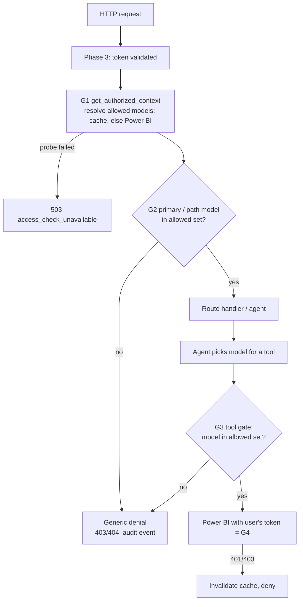

# Phase 5 — Authorization layer: implementation design

Status: **APPROVED and IMPLEMENTED 2026-10-06** (see plan Phase 5 for the delivery notes). Decisions applied: Q15 (allowed cache 10 min), Q15b (denied cache 2 min), Q16 (generic denials).

## 1. Goal

Before any retrieval, tool call or Power BI query, the backend knows exactly which semantic models the signed-in user
may use. Anything outside that set is refused with a generic message. Power BI remains the source of truth. Our
check is a fast gate in front of it.

## 2. "Middleware" — where the authorization check sits

The requirement is that a middleware checks the user's model authorization and the request only moves further if it
passes. A **global ASGI middleware alone cannot do this correctly**, for three reasons:

1. It runs **before routing and body parsing**. It would have to re-parse JSON bodies and duplicate validation.
2. For chat, **which models a question touches is only known after the agent's router reads the question**, for
   example "Compare Sales with Finance" (cross-model, ADR 0003). A middleware at the HTTP edge can't see that.
3. It must not buffer streaming (SSE) responses.

So the check is implemented as **three gates**. Each one checks first and only then lets the request continue:

| Gate | Implemented as | Runs | Checks |
|---|---|---|---|
| **G1 Request gate** | FastAPI dependency `get_authorized_context` (FastAPI's per-route middleware) | Before the route handler, on every protected route | Valid token (Phase 3), then resolves the user's **allowed model set**, then builds an immutable `AuthorizedContext` |
| **G2 Model gate** | Dependency `require_model_access(model_id)` / `authz.assert_allowed(...)` | Before the handler for routes with a model in the path, and before the agent starts for the Format-pane primary model | Requested model ∈ allowed set, else generic denial **before any retrieval** |
| **G3 Tool gate** | Decorator `@requires_model_access` on every agent tool that takes a model id (used from Phase 6/8) | Before every tool call | Re-checks the model the agent picked. Catches hallucinated or injected model ids and cross-model routing |

Power BI itself is **G4**. Every query runs with the user's own token, so revoked access fails there even if our
cache is stale.



## 3. Components (new code)

```text
backend/app/authz/
├── models.py        AuthorizedContext, AccessDecision, DenialReason
├── probe.py         ModelAccessProbe (interface)
│                    ├─ PowerBiRestAccessProbe   GET /v1.0/myorg/datasets/{id} with the user's OBO token
│                    └─ DevAccessProbe           local mapping from .env (AUTH_PROVIDER=dev only)
├── service.py       AuthorizationService: get_allowed_models, assert_allowed, on_power_bi_denied
├── dependencies.py  get_authorized_context, require_model_access, AuthorizedDep
├── guards.py        @requires_model_access decorator for agent tools
└── messages.py      the generic denial texts (single place)
backend/app/api/v1/models.py   GET /models/accessible, GET /models/{model_id}
backend/app/jobs/registry.py   CLI: add/enable/disable a model in the registry
```

### 3.1 `AuthorizedContext` (immutable, server-built)

```python
@dataclass(frozen=True)
class AuthorizedContext:
    request: RequestContext              # identity + correlation id (Phase 3)
    user_id: uuid.UUID                   # users table row (upserted on each request)
    allowed: Mapping[str, ModelSummary]  # pbi_dataset_id -> name/domain; ONLY allowed models
    resolved_at: datetime

    def is_allowed(self, dataset_id: str) -> bool: ...
```

The agent and tools receive this object from the server. Nothing the LLM outputs can add a model to it.

### 3.2 How "can this user access model X?" is answered

Probe: **`GET https://api.powerbi.com/v1.0/myorg/datasets/{datasetId}`** with the user's delegated Power BI token
(OBO, Phase 3). Microsoft documents that it works for a model "in My workspace or another workspace, provided the
caller has the required permissions". So it also covers models shared with the user directly, not only through a
workspace role.

| Power BI response | Decision | Cached as |
|---|---|---|
| 200 | allowed | `allowed`, 10 min (Q15) |
| 401 / 403 / 404 | denied | `denied`, 2 min (Q15b) |
| 429 / 5xx / timeout | **unknown → treated as not allowed for this request** (fail closed) | not cached. The user sees "couldn't verify access, try again" (503) |

- Candidates are only registry models with `chatbot_enabled = true` and `status = active`. Models not in the
  registry never reach the agent.
- Probes run **in parallel with a concurrency cap** (default 8) and a timeout (default 10 s). Only models whose cache
  entry is missing or expired are probed.
- Build permission is **not** probed (no cheap API). If the REST fallback later hits "needs Build", Phase 6 maps it to
  its own message. Fabric IQ (primary) doesn't need Build.

### 3.3 Cache and revalidation policy

```text
for each candidate model:
    row = user_model_access[user, model]
    if row is fresh (now < expires_at):  use it
    else:                                probe Power BI, upsert row

before showing a denial for a model the user explicitly asked for:
    if the denial came from cache:       probe live once more    (access granted 1 min ago works now)

when Power BI returns 401/403 during a real query (Phase 6 hook):
    on_power_bi_denied(user, model) ->   mark denied, invalidate, deny   (revoked access caught immediately)
```

The cache is the existing Postgres table `user_model_access`, so it is shared by all backend instances. Expired rows are
already removed by the Phase 4 cleanup job.

### 3.4 Denials (Q16 = generic)

- **One message for every reason:** model doesn't exist, isn't enabled for the chatbot, user lacks access, or part of a
  cross-model request is not allowed.

  > "I can't answer that because it needs data you don't have access to. I can help with questions about the data
  > available to you."

- The restricted model's name, measures, schema or id are **never** shown, and the denial never says *which* part of a
  question was blocked.
- Cross-model request with one denied model: the **whole** request is denied. Nothing executes.
- HTTP routes: `GET /models/{id}` returns the **same 404** for "doesn't exist" and "not allowed" (no existence probing,
  same pattern as sessions).
- Admins still get the detail: every decision is written to `audit_events` (`authz.decision`, allow/deny,
  `pbi_dataset_id`, reason code). The user never sees it.

### 3.5 Development mode (before IT delivers)

With `AUTH_PROVIDER=dev` there is no Power BI token, so `DevAccessProbe` reads a local mapping:

```env
# Which registry models each dev user may access (dev only; ignored in entra mode)
DEV_MODEL_ACCESS={"user-a": ["sales-dataset", "hr-dataset"], "user-b": ["finance-dataset"]}
```

This lets the full chain (allowed list, denials, cache, audit) run end to end locally now. The real probe is unit-tested
with a mocked Power BI and verified live in spike S2 once IT delivers.

### 3.6 Registry CLI

Models must be in the registry before anyone can use them. Small admin command:

```bash
uv run python -m app.jobs.registry add --dataset-id <id> --workspace-id <id> --workspace-name "Sales WS" \
    --name "Sales" --domain Sales --enable
uv run python -m app.jobs.registry list
uv run python -m app.jobs.registry disable --dataset-id <id>
```

## 4. Endpoints added

| Method | Path | Gate | Returns |
|---|---|---|---|
| GET | `/api/v1/models/accessible` | G1 | Only allowed models: `[{id, name, domain}]`. Feeds the Format-pane dropdown |
| GET | `/api/v1/models/{model_id}` | G1 + G2 | Model summary, or generic 404 |

The chat endpoint (Phase 9) will use G1 + G2 on the primary model, and the agent tools (Phase 8) will use G3.

## 5. Configuration (`.env`)

| Setting | Default | Meaning |
|---|---|---|
| `AUTHZ_ALLOWED_TTL_MINUTES` | **10** (Q15) | How long an "allowed" decision is trusted |
| `AUTHZ_DENIED_TTL_MINUTES` | **2** (Q15b) | How long a "denied" decision is trusted for list building |
| `AUTHZ_PROBE_CONCURRENCY` | 8 | Parallel Power BI checks per request |
| `AUTHZ_PROBE_TIMEOUT_SECONDS` | 10 | Per-check timeout |
| `DEV_MODEL_ACCESS` | `{}` | Dev-mode access map (§3.5) |

Invalid values fall back to the defaults, the same behaviour as the retention settings.

## 6. Decided: denied TTL (Q15b = 2 minutes)

**Q15b: the "denied" TTL.** Because a denial for a model the user explicitly asks about is always rechecked live
(§3.3), the denied TTL only affects how quickly a newly granted model **appears in the dropdown / router list**
without being asked for. **Decision: 2 minutes.**

## 7. Tests (security scenarios)

| # | Scenario | Test |
|---|---|---|
| 1 | Has access | allowed list contains the model; G2 passes |
| 2 | No access | not in list; G2 generic 404/denial; audit row written |
| 4 | Access newly granted | cached deny, then explicit request, live recheck, allowed |
| 5 | Access revoked | cached allow, then `on_power_bi_denied`, denied on next check |
| 6 | Cross-model, one denied | `assert_allowed([sales, finance])` denies the whole request, generic message |
| 11 | Forged model id | unknown / unregistered / disabled id gives the same generic denial |
| 20 | Follow-up after revocation | every request rebuilds `AuthorizedContext` (cache TTL + live recheck) |
| — | Probe failure | 5xx/timeout fails closed, 503, not cached |
| — | Cache sharing | two app instances (two sessionmakers) see the same cache rows |
| — | G3 | decorated tool called with a non-allowed id is refused before its body runs |
| — | Generic text | denial bodies never contain the denied model's name or id |

## 8. Not in Phase 5

- Real Power BI query execution and its 401/403 mapping into `on_power_bi_denied`: Phase 6.
- The agent and its tools using G3: Phase 8 (the decorator and its tests ship now).
- Chat endpoint: Phase 9.
