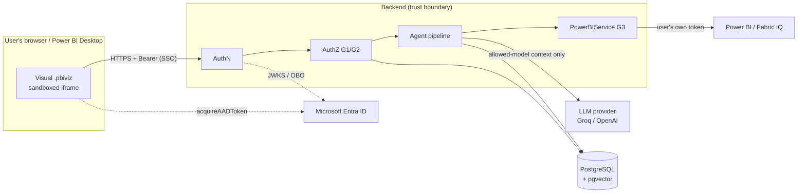

# Threat model — Discover Chat Bot

- Method: STRIDE per component, against the core invariant: no request can cause the system to query or reveal a
  semantic model the user is not authorized for.
- Date: 2026-10-07 (Phase 11). Review it whenever a trust boundary changes.

## 1. System and trust boundaries

| Boundary | What crosses it | Trust |
|---|---|---|
| Visual → Backend | question, report filter values, model id hint, bearer token | **Untrusted.** Everything is validated and re-authorized |
| Backend → LLM provider | allowed-model metadata, question, result rows (≤ 50) | **Disclosed to a third party** (by design, Q2). The LLM's output is untrusted |
| Backend → Power BI | DAX, user's delegated token | Power BI is the authority (RLS/OLS) |
| Backend → Postgres | conversations, audit, cache, embeddings | Internal; protected by retention (Q9) |

## 2. STRIDE

| # | Threat | Component | Control (where) | Test / evidence | Residual |
|---|---|---|---|---|---|
| S1 | **Spoofing:** forged or expired token, other tenant, other app | AuthN | RS256 JWKS validation, audience, issuer per tenant, tenant allow-list, Power BI client-app allow-list, scope (`app/auth/entra.py`) | `test_auth_entra.py`, scenarios 10/13/14 | Live Entra check pending (spike S1) |
| S2 | **Spoofing:** dev sign-in used outside development | AuthN | `DevAuthProvider` / `/dev/token` refuse non-local; prod config guard | `test_auth_config.py`, `test_security_extras.py` | — |
| S3 | **Spoofing:** visual token sent to a rogue backend | Visual | Backend origin fixed at build time + `WebAccess` privilege, HTTPS only | `configure.mjs` | — |
| T1 | **Tampering:** forged `model_id` / `session_id` in requests | API | Treated as hints: `assert_allowed`, owner checks, identical 404s | scenarios 11/22 | — |
| T2 | **Tampering:** prompt injection in the question or data | Agent | No LLM tool access; pydantic plans; server validation; untrusted-data delimiters; numeric grounding | red-team suite (33 cases), scenario 12 | A compromised LLM can still give wrong *wording* within allowed data |
| T3 | **Tampering:** malicious DAX (DMV, `INFO.*`, multiple `EVALUATE`) | Agent / Power BI | `ensure_read_only_query` + `validate_dax` on every query | scenario 17, red-team `qs-*` | DAX is read-only by nature |
| R1 | **Repudiation:** who accessed what | Audit | `audit_events` for every explicit authz decision, committed independently of the request | `test_authz_service.py` | Audit kept 90 days (Q9b) |
| I1 | **Information disclosure:** restricted model's data | Power BI path | G1/G2/G3 + Power BI enforcement with the user's own OBO token | scenarios 1–7, 20 | — |
| I2 | **Information disclosure:** restricted model's metadata (names, schema) to user or LLM | Retrieval / agent | SQL model filter before ranking; LLM context only from allowed models' visible schema; generic denials; existence-agnostic validator feedback | scenarios 8/9/11, red-team leak invariant | — |
| I3 | **Information disclosure:** OLS-hidden objects | Retrieval / agent | Per-user schema intersection; plan/DAX validation against the user's schema | scenario 16, red-team `ex-*` | Fabric IQ payload shape unverified (S3) |
| I4 | **Information disclosure:** RLS rows across users | Power BI path | Each query uses that user's token; no result caching | scenario 15 | — |
| I5 | **Information disclosure:** tokens or user content in logs | Logging | Q18 policy; redacting formatter; chatty libraries pinned to WARNING | `test_no_user_content_reaches_the_logs`, `test_tokens_never_reach_the_logs` | Third-party exception text is redacted for secrets but not for content |
| I6 | **Information disclosure:** data held by the LLM provider | LLM | Only allowed context and ≤ 50 rows sent; provider chosen in `.env` | — | **Accepted:** the provider sees questions and results; to be reviewed with IT before production (entra-setup §5) |
| I7 | **Information disclosure:** data at rest | Postgres | No raw result rows stored (Q9c); retention cleanup; no data values in the index | `test_cleanup.py`, retention tests | DB encryption/backups: Phase 13 |
| D1 | **Denial of service:** flooding / runaway turns | Chat API | 20 questions/min, 2 parallel, one per conversation, 120 s timeout, cancel on disconnect, 64 KB bodies | `test_chat_api.py`, scenario 19 | **Limits are per instance** (Phase 13: shared store) |
| D2 | **Denial of service:** Power BI throttling | Power BI path | Per-user REST limiter (120/min), backoff, friendly 429 | scenario 19 | — |
| E1 | **Elevation of privilege:** acting beyond the user's own Power BI rights | Whole system | No service principal for data access; delegated OBO only; Fabric IQ refuses service principals | design (ADR 0005/0006) | — |
| E2 | **Elevation of privilege:** unsafe production configuration | Startup | `production_problems()` refuses dev auth, `dev_synthetic`, CORS `*`, empty tenant list, dev settings, DEBUG logs; docs hidden in prod | `test_security_extras.py` | — |

## 3. Supply chain and secrets

- **Dependencies:** `pip-audit` (backend, locked versions) and `npm audit` (visual, shipped + dev).
- **Secrets:** gitleaks over the git history and the working tree.
- Run with `scripts/security-scan.sh`. Results are in [scan-results.md](scan-results.md).

## 4. Open items (owned)

| Item | When |
|---|---|
| Live SSO / OBO / Fabric IQ verification | Spikes S1–S3, after IT delivers |
| LLM provider data-processing review | Before production, with IT |
| Shared rate limits across instances, DB encryption, backups, CI security gates | Phase 13 |
| Real-model red-team run (`pytest -m network -k redteam`) | When `GROQ_API_KEY` is available |
